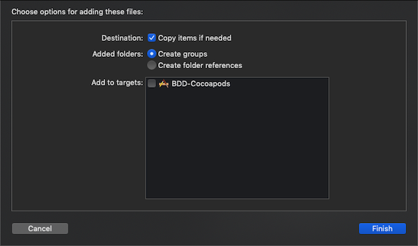
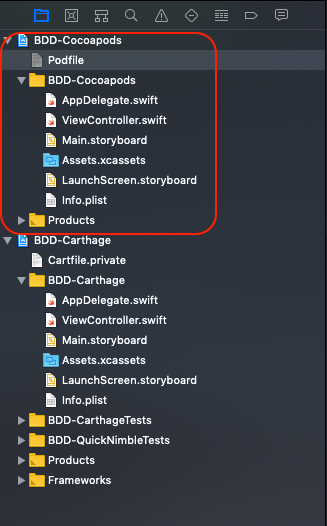
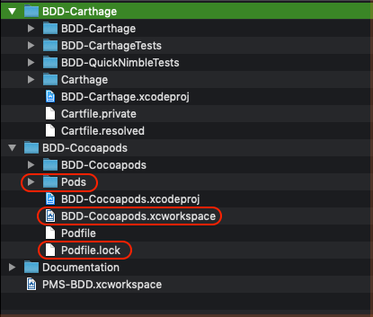
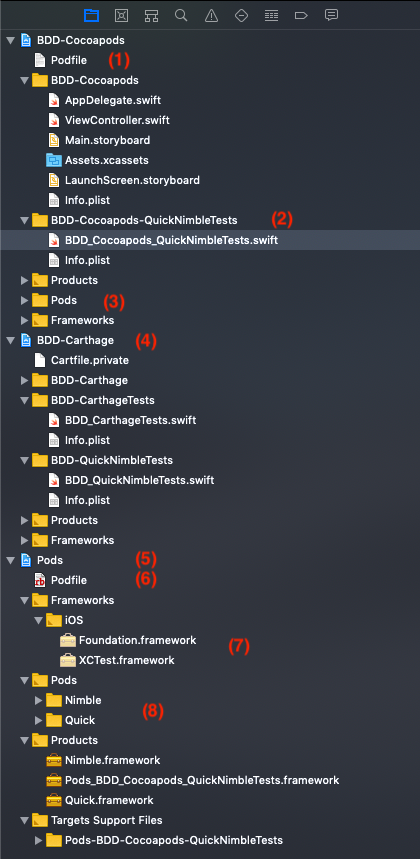
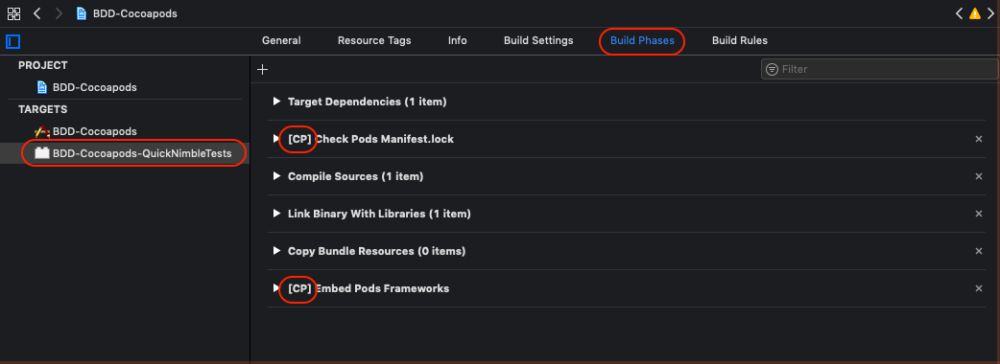

[🏡 Home](https://primecoder.github.io/)
\> [Main](https://primecoder.github.io/Package-Management-Study/)
\> 📍

# Package Management: CocoaPods & Xcode

In my previous post, [Package Management: Carthage & Xcode], I looked at how to setup and use Carthage with the Xcode. In this post, I will be doing the same thing, but, with using CocoaPods instead.

So, for a fair comparison, I used the same components as in my previous post:

- [Quick/Quick on Github]
- [Quick/Nimble on Github]

I decided to continue using my previous Xcode's workspace - [Package Management Study]. After all, the whole idea is to group all my experiments, findings, and etc, all in one place - an Xcode's workspace. Head to where I keep my project and open the workspace.

```
$ tree -FL 1
.
├── BDD-Carthage/
└── PMS-BDD.xcworkspace/

$ open PMS-BDD.xcworkspace/
```

Stay true to my KISS philosophy, I added the simplest iOS single view project to my workspace - BDD-Cocoapods project. If you know me, I am OCD with red-green-refactor approach, I hit CMD+R to make sure the new project build and run correctly.

Quick checking [Using CocoaPods] page, all I needed was to add a Podfile to my project. If you have not installed Cocopods, you can see my previous post [here][setup pms]. I used `pod init` to quickly create Podfile for me.

```
$ cd [DIR WITH XCODE PROJECT]
$ pod init
```

`pod init` reads you Xcode's .xcodeproj file and creates initial Podfile for you. I dragged & dropped the newly created Podfile into the top-level of my project file and added Quick & Nimble pods to it. I added the Podfile to Xcode project for convenient of editing it with Xcode, so make sure don't select `Add to targets` when adding as this file is not to be build or included into the binary of your project, see image below.



Here is my initial Podfile and the structure of my workspace.

```
platform :ios, '12.2'

target 'BDD-Cocoapods' do
    use_frameworks!

    pod 'Quick'
    pod 'Nimble'
end
```



From the image above, circled in red is the new Xcode project - BDD-Cocoapods - residing in the same Xcode's workspace as my previous project BDD-Carthage.

Next step is to let CocoaPods does it magic - analyses Podfile, works out the dependencies for all the 'pods' or frameworks specified, downloads, and builds all the pods.

```
$ pod install
```

Here is the output from Terminal:

```
Analyzing dependencies
Downloading dependencies
Installing Nimble (8.0.1)
Installing Quick (2.1.0)
Generating Pods project
Integrating client project

[!] Please close any current Xcode sessions and use `BDD-Cocoapods.xcworkspace` for this project from now on.
Sending stats
Pod installation complete! There are 2 dependencies from the Podfile and 2 total pods installed.
```

Take a look at the directories and files that CocoaPods generates.



Impressive! CocoaPods does every thing for me. But wait! Checking the above warning! It said that it created a new workspace for me! And that I should start using this workspace instead of the old .xcodeproj file! This is not going to work for me as I already have a workspace and all projects setup. I wanted to continue using my own setup. So, I headed back to [Using CocoaPods] page. My Podfile needs modification as shown here:

```
platform :ios, '12.2'

workspace '../PMS-BDD'

target 'BDD-Cocoapods' do
    use_frameworks!

    pod 'Quick'
    pod 'Nimble'
end
```

Note the line:

```
workspace '../PMS-BDD'
```

Since, I like to keep everything-CocoaPods contained within this project, I chose to keep Podfile at where it was and use relative path to refer to the workspace, hence `../PMS-BDD`.

I removed all the directories and files created by CocoaPods and rerun `pod install` again. This time - no complain.

```
Analyzing dependencies
Downloading dependencies
Installing Nimble (8.0.1)
Installing Quick (2.1.0)
Generating Pods project
Integrating client project
Sending stats
Pod installation complete! There are 2 dependencies from the Podfile and 2 total pods installed.
```

Checking the directory structure was all good - everything is at where it supposes to be - self-contained within `BDD-Cocoapods` project.

Built was successful. However, when I tried to run the project on the simulator, I got this error message:

```
dyld: Library not loaded: @rpath/XCTest.framework/XCTest
  Referenced from: /Applications/Xcode.app/Contents/Developer/Platforms/iPhoneOS.platform/Developer/Library/CoreSimulator/Profiles/Runtimes/iOS.simruntime/Contents/Resources/RuntimeRoot/usr/lib/swift/libswiftXCTest.dylib
  Reason: image not found
```

I was such a dummy, Quick & Nimble have dependencies on XCTest framework, but from the Podfile, I linked them to non Test target. This is easily fixed.

I created a new Test target called `BDD-Cocoapods-QuickNimbleTests`, added a new Test class `BDD_Cocoapods_QuickNimbleTests` with the following contents (pinched from the BDD_Carthage project):

```
import Quick
import Nimble

class BDD_Cocoapods_QuickNimbleTests: QuickSpec {

    func isWorking() -> Bool {
        return true
    }

    override func spec() {

        it("is working") {
            expect(self.isWorking()).to(beTrue())
        }

        context("When project has just been build") {
            it("is working") {
                expect(self.isWorking()).to(beTrue())
            }
        }

        describe("Quick and Nimble") {
            it("is working") {
                expect(self.isWorking()).to(beTrue())
            }
        }

        describe("Quick and Nimble") {
            context("When project has just been build") {
                it("is working") {
                    expect(self.isWorking()).to(beTrue())
                }
            }
        }
    }
}
```

The Podfile needs to be modified Podfile as follow:

```
platform :ios, '12.2'

workspace '../PMS-BDD'

target 'BDD-Cocoapods-QuickNimbleTests' do
    use_frameworks!

    pod 'Quick'
    pod 'Nimble'
end
```

Rerun `pod install` and re-open the workspace again. All targets should build and run correctly. All test cases should pass now.

Let's take a look at our workspace.



(1) This is our Podfile. It is contained purposefully within our BDD-Cocoapods project

(2) This is our Test target which contains codes to test our Quick & Nimble frameworks

(3) BDD-Cocoapods project is displayed side-by-side as a comparison against BDD-Carthage project. They appear pretty much similar, except this (3) `Pods` folder which contains Xcode's configurations for building pods for each environment, i.e. Debug, or Release.

(4) BDD-Carthage project is listed here for reference and comparison purposes

(5) This is `Pods` project, added to our workspace by the Cocoapods when you run `pod install` command

(6) This is the Podfile used to created this project. It is the same as (1)

(7) This section lists all the frameworks used to build this project

(8) These are all the pods as you specified in `Podfile`

Pretty neat, eh? I like the structure of the project so far. Very straight forward.

Some other areas worth checking are Xcode's project settings of the target(s) that uses the pods.



CocoaPods was nice enough to show which part of the settings have been added or modified - they are padded with `[CP]` prefixes. These are the areas where all the `magics` happen. You can expand each section and learn from all the scripts there - I will leave it there as your own personal challenges.

## Thoughts - Beauty is in the eyes of be(er)-holder

I have been using Carthage extensively for my previous client for almost 2 years and have been very comfortable using it. Time and again, I would hear people compared Carthage Vs CocoaPods. Those that favoured Carthage would say that CocoaPods are the blackboxes and that they do not feel comfortable trusting it. This may be true at first, for me. However, after using CocoaPods for a while I have grown accustomed to the convenient and ease of use provided by the Pods. Below are my thoughts on using CocoaPods:

- Integrity is more important. With CocoaPods, you get to work with workspaces instead of projects. The pods you use are obvious and visibly included right there, together with your project. When someone, i.e. a new team member, opens your workspace, s/he can see, right away, that your project use external frameworks and how they are organised within the Pods project.

- The `magic` scripts, which run behind the scene, are the work of opensource community. They are transparent and subjected to being scrutinised by the community. The chance of containing malicious or errors is minimised.

- Each external framework's source code is also there - included for your inspection, modification and building as part an integral parts of your workspace's targets.

- The chance of including incorrect framework or incorrect version or incorrect build to the final product is also minimised as any modification that you've done to these frameworks are included and built together with your project.

This is rather a very long post. However, I do hope you enjoy the experience I shared above. Please feel free to leave comments, suggestions, or questons you may have.

Until next post, stay well and see you later.

Peace.

[references]: ()
[package management study]: (https://github.com/primecoder/Package-Management-Study)
[package management: carthage & xcode]: (http://www.icuriosity.com/2019/04/package-management-carthage-xcode.html)
[quick/quick on github]: (https://github.com/Quick/Quick)
[quick/nimble on github]: (https://github.com/Quick/Nimble)
[using cocoapods]: (https://guides.cocoapods.org/using/using-cocoapods.html)
[setup pms]: (http://www.icuriosity.com/2019/04/package-management-carthage-vs.html)
