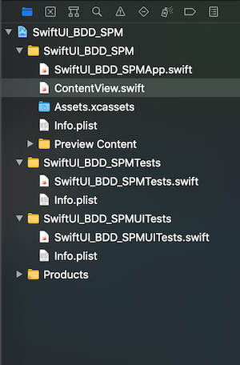
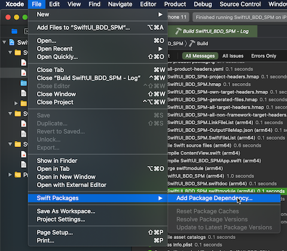
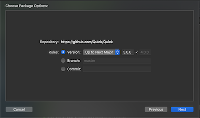
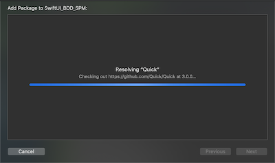
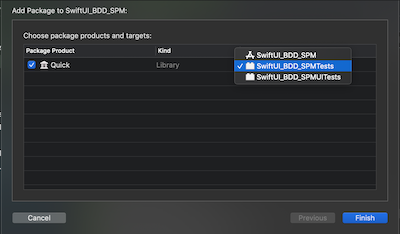
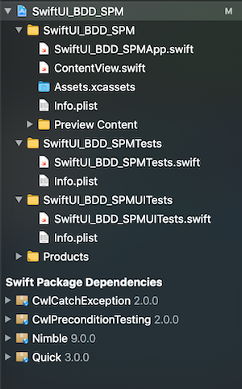

[🏡 Home](https://primecoder.github.io/)
\> [Main](https://primecoder.github.io/Package-Management-Study/)
\> 📍

# Xcode's Swift Package Management

Xcode's very own Package Management.

My Setup:

- Xcode 12 (available since Xcode 11)
- Mac OS 11 (Big Sur)

